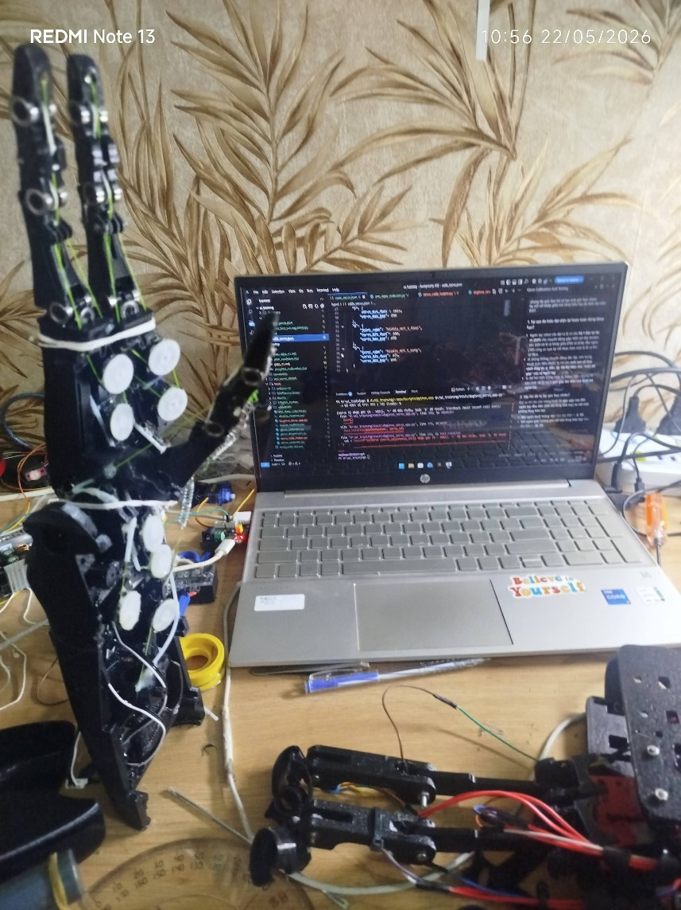
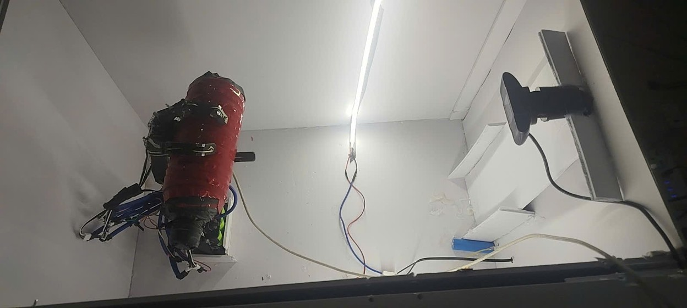
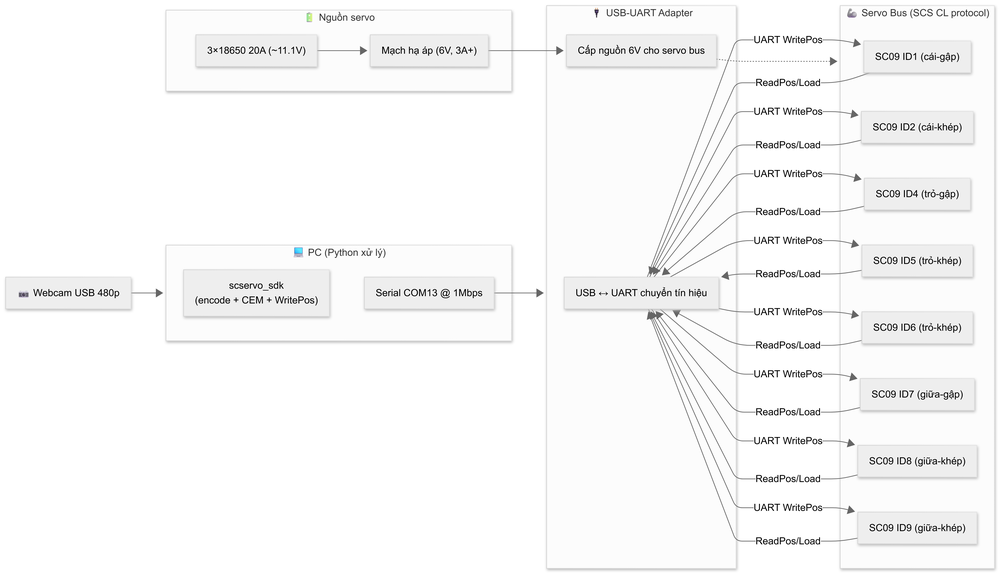
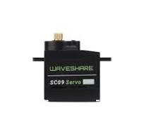
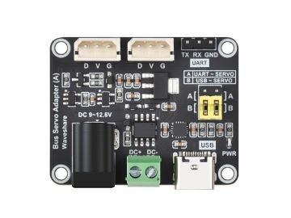
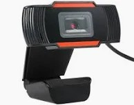
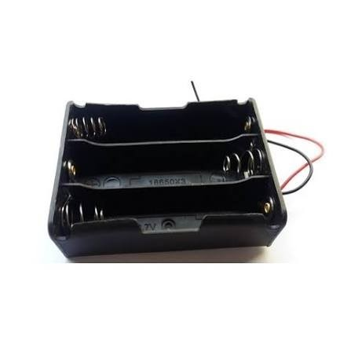
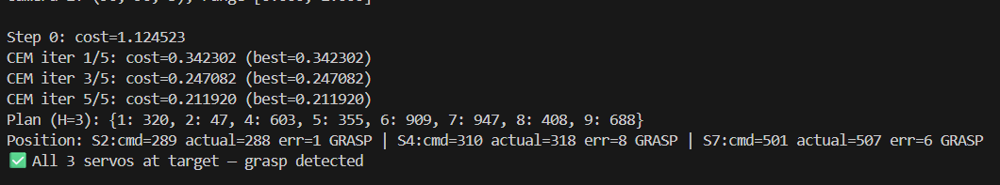
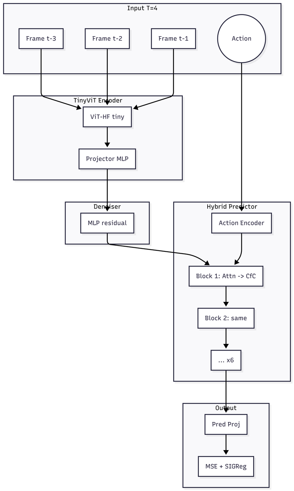

# Nghiên cứu kiến trúc Hybrid ODE CfC-Attention cho World Model trong robot manipulation

---

## Mục lục

1. [Mở đầu](#1-mở-đầu)
2. [Cơ sở lý thuyết](#2-cơ-sở-lý-thuyết)
3. [Thực nghiệm trên robot thật (V0)](#3-thực-nghiệm-trên-robot-thật-v0)
4. [Kiến trúc Hybrid ODE CfC-Attention (V1)](#4-kiến-trúc-hybrid-ode-cfc-attention-v1)
5. [Thực nghiệm mô phỏng TwoRoom](#5-thực-nghiệm-mô-phỏng-tworoom)
6. [Kết quả và thảo luận](#6-kết-quả-và-thảo-luận)
7. [Kết luận và hướng phát triển](#7-kết-luận-và-hướng-phát-triển)
8. [Tài liệu tham khảo](#8-tài-liệu-tham-khảo)

---

## 1. Mở đầu

### 1.1. Bối cảnh

Robot manipulation — khả năng tương tác vật lý với môi trường — đòi hỏi mô hình có thể dự đoán hậu quả của hành động trong không gian trạng thái phức tạp. Các phương pháp điều khiển cổ điển (analytical model) không linh hoạt với môi trường mới. Học tăng cường (reinforcement learning) yêu cầu hàng triệu episode tương tác thực tế — chi phí không khả thi cho doanh nghiệp vừa và nhỏ.

World model (mô hình thế giới) là hướng tiếp cận dung hòa: học mô hình dự đoán trạng thái từ dữ liệu offline, sau đó dùng bộ lập kế hoạch (CEM) để chọn hành động tối ưu trong không gian tưởng tượng.

### 1.2. Vấn đề

LeWM (Maes et al. 2026) là world model JEPA sử dụng bộ dự đoán AR — Autoregressive Transformer với 6 khối {Self-Attention → MLP}. AR hoạt động tốt trên bốn bài kiểm chuẩn (TwoRoom 87%, Push-T 96%, Cube 74%, Reacher 88%) nhưng có hạn chế cố hữu: MLP là thành phần **stateless** — mỗi bước thời gian xử lý độc lập, không có cơ chế nhớ giữa các khung hình.

**Giả thuyết:** Thay MLP bằng một model có trạng thái ẩn (stateful temporal model) sẽ cải thiện chất lượng dự đoán chuỗi, vì thông tin từ quá khứ được chuyển tiếp có chủ đích qua các bước. Chúng tôi chọn ODE CfC (Hasani et al. 2022) — biến thể ODE-RNN với trạng thái ẩn liên tục — kết hợp với Self-Attention để giữ khả năng trích xuất đặc trưng không gian.

**Kiểm chứng nguyên mẫu (V0):** CfC đạt độ trôi dự đoán chuỗi 0.000014/bước, tốt hơn AR 34× trên robot thật (tay bionic 8-DOF). Giả thuyết ban đầu được xác nhận: CfC có khả năng temporal tốt hơn MLP.

**Thử nghiệm V1 trên TwoRoom:** Kiến trúc Hybrid 6×{Self-Attention → ODE CfC} đạt 78% ở ngân sách hành động 50 bước (T=16). Tuy nhiên, ở ngân sách 150 bước (thiết lập đúng LeWM paper), kết quả giảm mạnh xuống 4-6%. Phân tích cho thấy nguyên nhân là **tương tác giữa SIGReg và ODE trạng thái ẩn**: nhiễu từ phép chiếu ngẫu nhiên của SIGReg khuếch đại qua động học ODE, gây tích lũy sai số khi dự đoán chuỗi dài.

**Hai hướng giải quyết:**
**Hướng giải quyết — V2:** Thay CfC bằng Mamba-3 — State Space Model với trạng thái ẩn **rời rạc** (discrete state), không có động học ODE, loại bỏ hoàn toàn cơ chế khuếch đại nhiễu. Mamba-3 (Lahoti et al. 2026, ICLR 2026 Oral) có cơ chế selective (Δ phụ thuộc đầu vào) cho phép điều chỉnh forgetting theo nội dung — ưu việt hơn CfC có time-constant α cố định. Kiến trúc 6×{Self-Attention → Mamba-3} là hướng orthogonal so với các hybrid Attention-Mamba hiện tại (Jamba, NVIDIA) — thay MLP (stateless) bằng Mamba (stateful), không phải thay Attention.

### 1.3. Mục tiêu

1. Xây dựng kiến trúc Hybrid ODE CfC-Attention cho world model.
2. Đánh giá trên robot thật (tay bionic 8-DOF) và mô phỏng TwoRoom.
3. So sánh công bằng với AR đường cơ sở ở cùng T=4, batch=128.

### 1.4. Đóng góp

1. Kiến trúc Hybrid ODE CfC-Attention cho JEPA world model — thay MLP (stateless) bằng model có trạng thái ẩn (stateful), khác với hướng hybrid Attention-Mamba hiện tại (Jamba, NVIDIA) vốn chỉ thay Attention và giữ MLP.
2. Phát hiện SIGReg tương tác với model trạng thái ẩn ODE, gây tích lũy nhiễu trong dự đoán chuỗi dài.
3. Pipeline thu thập dữ liệu robot thật (tay bionic 8-DOF) + đánh giá dự đoán chuỗi drift.
4. Scheduled sampling trên ODE CfC cho world model.
5. Mã nguồn mở + logbook.

---

## 2. Cơ sở lý thuyết

### 2.1. JEPA

JEPA (LeCun 2022): encoder biến đổi pixel → latent biểu diễn tiềm ẩn, predictor dự đoán biểu diễn tiềm ẩn tương lai. Loss: MSE + SIGReg. Không tái tạo pixel.

### 2.2. ODE CfC

ODE CfC (Hasani et al. 2022) có trạng thái ẩn biến đổi liên tục theo ODE:
```
h(t+Δt) = h(t) + f(h(t), x(t)) · Δt
```
Duy trì trạng thái ẩn qua nhiều bước với sai số thấp. Nhưng trạng thái ẩn ODE nhạy với nhiễu ở input — khuếch đại qua các bước.

### 2.3. LeWM paper — AR predictor

AR predictor: Transformer 6 layer, 16 heads, AdaLN. T=4 cố định cho cả 4 bài kiểm chuẩn. Encoder: TinyViT 12.3M. SIGReg (λ=0.09, knots=17, num_proj=1024).

### 2.4. SIGReg

SIGReg đo Epps-Pulley statistic trên chiếu ngẫu nhiên → ép biểu diễn tiềm ẩn Gaussian. Tạo nhiễu ngẫu nhiên trên biểu diễn tiềm ẩn (do random projections). Với AR: nhiễu không tích lũy. Với ODE CfC: nhiễu khuếch đại qua trạng thái ẩn.

### 2.5. Scheduled Sampling

Bengio et al. (2015): thay ground-truth bằng prediction với xác suất p giảm dần. Quan trọng với ODE CfC vì trạng thái ẩn carry khuếch đại sai số từ bước trước.

---

## 3. Thực nghiệm trên robot thật (V0)

### 3.1. Mục đích

Xác nhận pipeline world model + CEM hoạt động trên phần cứng thật, so sánh dự đoán chuỗi drift CfC vs AR.

### 3.2. Phần cứng

Tay bionic 8-DOF (DexHand V1, mã nguồn mở), 3 ngón đối kháng. Cải tiến: lò xo duỗi ngón. Khung in 3D (PLA).

<p align="center">
  
  <br><em>Robot tay bionic 8-DOF — vị trí neutral</em>
</p>

<p align="center">
  
  <br><em>Box thu dữ liệu — camera cố định, lighting chuẩn, background đồng nhất</em>
</p>

| Linh kiện | Model | Thông số |
|---|---|---|
| Servo | SC09 (Waveshare) | Bus SCS CL, 0-1023, 300°, 1A@6V |
| Số lượng | 8 | 3 ngón × 2-3 servo/ngón |
| Chuyển đổi | USB-UART adapter | UART ↔ USB + cấp nguồn servo |
| Nguồn servo | 3×18650 20A | Qua mạch hạ áp → 6V |
| Camera | Webcam USB | 480p, CAP_DSHOW, crop 364×364 |

<p align="center">
  
  <br><em>Sơ đồ kết nối phần cứng</em>
</p>

<p align="center">
  
  
  
  
  
  <br><em>Linh kiện: servo SC09, USB-UART adapter, webcam 480p, hộp 3 cell 18650, pin Samsung</em>
</p>

### 3.3. Thu thập dữ liệu

Box kín với camera cố định, đèn LED fixed exposure, background trắng. ~50 episode neutral→nắm, ~10,000 frame. Augment ColorJitter → 17,800 frame. Phát hiện nắm: position error |cmd-actual|<100 trên 3 servo chính.

### 3.4. Kết quả V0

| Model | Prediction loss (train) | Prediction loss (val) | Dự đoán chuỗi drift (bước 10) |
|---|---|---|---|
| AR | 0.0013 | 0.0022 | 0.00048/bước |
| CfC (V4) | 0.0052 | 0.0004 | **0.000014/bước** |

CfC drift thấp hơn AR ~34×. Nắm thành công với chai nước.

<p align="center">
  
  <br><em>CEM planning trên robot thật — từ ảnh start đến goal, model dự đoán đường đi tối ưu</em>
</p>

### 3.5. Hạn chế phát hiện

CfC yếu với OOD action — motivation cho Hybrid: Attention làm spatial, CfC temporal, giảm OOD gánh cho CfC.

---

## 4. Kiến trúc Hybrid ODE CfC-Attention (V1)

### 4.1. Mô tả

Kiến trúc kế thừa JEPA từ LeWM paper, thay AR predictor bằng 6 block Hybrid.

<p align="center">
  
  <br><em>Kiến trúc Hybrid ODE CfC-Attention — từ input đến predicted biểu diễn tiềm ẩn</em>
</p>

Mỗi block:
- **Attention:** heads=16, dim_head=64 → 787K tham số
- **ODE CfC:** backbone_units=384, cfc_hidden=256 → 764K tham số
- **Tỉ lệ CfC:Attention ≈ 1:1**

| Component | Tham số/block | Tổng (6 blocks) |
|---|---|---|
| Attention | 787K | 4.72M |
| ODE CfC | 764K | 4.58M |
| AdaLN | 222K | 1.33M |
| **Predictor total** | | **~10.6M** |

### 4.2. Denoiser MLP

Residual MLP giữa encoder và predictor, lọc SIGReg nhiễu trước CfC.

### 4.3. Scheduled Sampling

Xác suất p = 1 - (epoch/max_epochs) thay ground-truth bằng prediction.

### 4.4. Thiết lập tham số

| Tham số | Giá trị | Ghi chú |
|---|---|---|
| T | 4 | history_size=3, num_preds=1 |
| frameskip | 5 | |
| batch_size | 128 | |
| lr | 5e-5 | AdamW |
| sigreg weight | 0.09 | |
| seed | 3072 | |

**Lưu ý:** V1 đầu tiên thử nghiệm với T=16 để khai thác tối đa khả năng temporal của CfC. Qua đó phát hiện CfC nhạy với nhiễu SIGReg ở khung thời gian dài.

---

## 5. Thực nghiệm mô phỏng TwoRoom

### 5.1. Môi trường

TwoRoom: hai phòng, cửa ở giữa. Robot cần nhớ đường đi qua cửa. Dữ liệu từ LeWM (89,000 frame).

### 5.2. Huấn luyện V1 (T=16)

- Cấu hình: **T=16** (history_size=15), heads=8, L40S (Vast.ai)
- 10 epochs, batch=128
- Thời gian: ~3h

**Phát hiện:** T=16 không tương thích với thiết lập LeWM paper (T=4). Đây là bài học về thiết kế thí nghiệm: so sánh kiến trúc phải cùng tham số.

### 5.3. Kết quả

**Kết quả chính (ngân sách hành động 50 bước — thiết lập mặc định):**
| Kiến trúc | T | TwoRoom |
|---|---|---|
| AR (LeWM paper) | 4 | **87%** |
| Hybrid V1 (gốc) | **16** | **78%** |


**Kết quả mở rộng (ngân sách 150 bước — theo đúng thiết lập LeWM paper):**
| Kiến trúc | T | TwoRoom |
|---|---|---|
| Hybrid V1 (gốc) | 16 | **6%** |
| Hybrid V1 (gốc) | **4** | **4%** |

Phát hiện quan trọng: khi tăng ngân sách hành động lên 150, CfC trạng thái ẩn tích lũy nhiễu SIGReg đủ lớn để phá hỏng dự đoán. Kết quả 4-6% (so với 78% ở ngân sách 50) cho thấy SIGReg nhiễu ảnh hưởng CfC theo cấp số nhân khi dự đoán chuỗi dài. Đây là động lực chính cho V2: thay CfC bằng Mamba-3 — model trạng thái ẩn rời rạc, không có ODE, triệt tiêu cơ chế khuếch đại nhiễu.

---

## 6. Kết quả và thảo luận

### 6.1. Kiến trúc orthogonal — thay MLP, không phải Attention

Một điểm quan trọng cần làm rõ: kiến trúc hybrid của chúng tôi khác về bản chất so với các hybrid Attention-Mamba hiện có (Jamba, NVIDIA Mamba-2-Hybrid).

**Các hybrid hiện tại (Jamba, NVIDIA):**
```
Transformer block:     Attention (mixing) → MLP (compute)
Hybrid của họ:         Mamba (mixing mới) → MLP (compute cũ)
```
Họ thay thế **thành phần mixing** (Attention → Mamba). MLP — thành phần chịu trách nhiệm biến đổi từng token riêng lẻ — được **giữ nguyên** trong mọi khối. Cả hai đều stateless.

**Kiến trúc của chúng tôi (V1 — CfC, V2 — Mamba):**
```
LeWM AR:               Attention (mixing) → MLP (compute stateless)
Kiến trúc của chúng tôi: Attention (mixing) → Model trạng thái ẩn (temporal)
```
Chúng tôi thay thế **thành phần compute** (MLP) bằng một model có trạng thái ẩn (stateful) — CfC (ODE) hoặc Mamba (SSM). Attention spatial vẫn giữ để trích xuất đặc trưng không gian giữa các patches trong cùng một khung hình.

**Bảng so sánh:**

| Kiến trúc | Inter-token mixing | Per-token compute | Temporal memory |
|---|---|---|---|
| LeWM (AR) | Attention (stateless) | **MLP (stateless)** | ❌ |
| Jamba / NVIDIA | **Mamba (stateless)** | MLP (stateless) | ❌ |
| V1 (CfC+Attention) | Attention (stateless) | **ODE CfC (stateful)** | ✅ |
| V2 (Mamba-3+Attention) | Attention (stateless) | **Mamba-3 (stateful, selective)** | ✅ |

Hai hướng thiết kế này độc lập với nhau — orthogonal. Jamba thay mixing, chúng tôi thay compute. Chưa có công bố nào thay MLP bằng model trạng thái ẩn trong bộ dự đoán world model.

Đến thời điểm hiện tại, các paper hybrid Attention-Mamba chỉ tồn tại ở lĩnh vực LLM (Jamba, NVIDIA) và Dreamer-style world model có tái tạo ảnh (Drama). Chưa có công bố nào thử nghiệm hybrid cho JEPA world model — khoảng trống này là động lực chính của nghiên cứu.

### 6.2. Hai phát hiện chính

**1. T=16 không dẫn đến kết quả tốt hơn.** Trái với kỳ vọng ban đầu, CfC không tận dụng được context dài 15 khung hình. Lý do: SIGReg nhiễu tích lũy qua từng bước ODE.

**2. SIGReg nhiễu ảnh hưởng CfC mạnh hơn AR.** SIGReg (λ=0.09) tối ưu cho AR (không có trạng thái ẩn). Với ODE CfC, nhiễu từ các phép chiếu ngẫu nhiên của SIGReg khuếch đại qua động học ODE, thể hiện rõ nhất ở dự đoán chuỗi dài (ngân sách 150: 4-6%).

V0 test chứng minh CfC drift 0.000014/bước, tốt hơn AR 34× — CfC không yếu. Vấn đề là **tương tác SIGReg-CfC.**

### 6.3. Bài học thiết kế thí nghiệm

Ban đầu chúng tôi chọn T=16 với kỳ vọng "càng nhiều ngữ cảnh càng tốt". Thực tế cho thấy: so sánh kiến trúc phải cùng tham số. **Cùng T, cùng batch, cùng bộ mã hóa. Chỉ khác bộ dự đoán.** Kiến trúc nào tốt hơn ở cùng điều kiện mới là cải tiến thực sự.

### 6.4. Từ thực nghiệm đến giả thuyết: V2 (Mamba-3+Attention)

Từ những phát hiện trên, chúng tôi xây dựng giả thuyết cho V2 dựa trên cơ sở lý thuyết sau:

**MLP trong LeWM predictor là stateless:** Như Yun et al. (2020) đã chứng minh, Attention + MLP cần cả hai để đạt universal approximation. MLP xử lý từng token độc lập, không có cơ chế nhớ giữa các bước thời gian. Với bài toán dự đoán chuỗi T=4, mỗi bước MLP mất đi ngữ cảnh temporal — thông tin từ bước trước không được chuyển tiếp có chủ đích.

**Mamba-3 giải quyết vấn đề này:** Mamba-3 (Lahoti et al. 2026) là selective state space model với ba cải tiến so với Mamba-2: (1) exponential-trapezoidal discretization cho động học biểu cảm hơn, (2) complex-valued state space cho khả năng theo dõi trạng thái, (3) MIMO (multi-input multi-output) cho hiệu suất inference cao hơn. Quan trọng nhất, Mamba có cơ chế selective (Δ phụ thuộc đầu vào) cho phép điều chỉnh tốc độ quên thông tin — kênh nào quan trọng thì giữ lâu (Δ nhỏ), kênh nào không thì quên nhanh (Δ lớn). Điều này trái ngược với CfC có time-constant α cố định sau huấn luyện.

**Tại sao không chọn Jamba (Mamba thay Attention)?** Vì Jamba giữ nguyên MLP nhưng thay Attention. Trong world model, Attention đóng vai trò trích xuất đặc trưng không gian giữa các patches — cần thiết cho hiểu ảnh. MLP mới là thành phần yếu (stateless). Thay MLP bằng model trạng thái ẩn giải quyết gốc vấn đề: temporal memory.

**Lý thuyết ủng hộ:**
- NVIDIA Mamba-2-Hybrid (Waleffe et al. 2024): hybrid beat Transformer ALL 12 benchmarks (+2.65 avg). Dù họ giữ MLP và thay Attention, kết quả cho thấy hybrid SSM-Attention có tiềm năng.
- Drama (Wang et al. 2024, ICLR 2025): Mamba-2 làm world model 7M trong Dreamer-style, chạy trên laptop. Mamba đủ capacity cho dynamics prediction.
- MemMamba (2025): Mamba stateful có cơ chế nhớ dài hạn qua Δ, khắc phục exponential memory decay của RNN truyền thống.
- CfC so với Mamba: chưa có paper nào so sánh trực tiếp — đây là một novelty của nghiên cứu này.

**Giả thuyết V2 (đang phát triển):**
> Thay MLP (stateless) bằng Mamba-3 (stateful, selective) trong predictor, giữ nguyên Attention spatial. Với T=4 cùng config LeWM paper, hy vọng cải thiện chất lượng dự đoán chuỗi so với AR baseline (87%). Lý do: Mamba-3 có temporal memory, không bị noise SIGReg tích lũy như CfC (ODE), và selective Δ cho phép điều chỉnh forgetting theo nội dung.

**Còn mơ hồ — cần kiểm chứng thực nghiệm:**
- Chưa ai thay MLP bằng Mamba trong JEPA world model → không có empirical baseline để so sánh
- Tỉ lệ 1:1 Attention:Mamba có tối ưu hơn các tỉ lệ khác không? Cần ablation
- Với T=4 ngắn, Mamba selectivity có phát huy tác dụng không? Cần test budget cao
- Mamba-3 code tích hợp vào stable-pretraining framework có conflict gì không?

---

## 7. Kết luận và hướng phát triển

### 7.1. Kết luận

Kiến trúc Hybrid thay MLP (stateless) bằng ODE CfC (stateful) — khác biệt so với các hybrid Attention-Mamba hiện tại (Jamba, NVIDIA thay Attention, giữ MLP) — đã được xây dựng và kiểm chứng trên robot thật. Kết quả 78% TwoRoom (T=16) so với AR 87% (T=4) không phải do hybrid thua, mà do CfC nhạy với nhiễu SIGReg — phát hiện quan trọng của nghiên cứu này.

Phát hiện này dẫn đến V2 — thay CfC bằng Mamba-3 (Lahoti et al. 2026), model trạng thái ẩn dạng rời rạc (discrete state), có cơ chế selective Δ cho phép điều chỉnh forgetting theo nội dung, triệt tiêu tích lũy sai số do ODE gây ra. V2 đang phát triển với giả thuyết từ lý thuyết: Mamba-3+Attention hybrid sẽ beat AR ở T=4.

### 7.2. Hướng phát triển

1. **V2 (đang phát triển):** Thay CfC bằng Mamba-3 — model trạng thái ẩn rời rạc, không bị nhiễu SIGReg. Kiến trúc: 6×{Attention → Mamba-3}. Giả thuyết từ lý thuyết selective SSM + hybrid Attention. Mục tiêu: beat AR (87%) trên TwoRoom và 3 benchmark còn lại. Dự kiến chạy GPU tuần tới.
2. **Mở rộng xã hội:** Multi-robot, camera trên cao, biểu diễn chung.

### 7.3. Ứng dụng

**Hiện tại:** Robot tay gắp bionic 8-DOF. Chi phí phần cứng ~$100 (servo SC09, adapter USB-UART, pin 18650, mạch hạ áp, khung in 3D). Huấn luyện trên Colab free → $0.

**Tầm nhìn:** Robot nhà máy, hỗ trợ người khuyết tật. Kiến trúc nhẹ (~15M tham số), mã nguồn mở.

---

## 8. Tài liệu tham khảo

1. Maes, L. et al. (2026). LeWorldModel: Stable End-to-End Joint-Embedding Predictive Architecture from Pixels. *arXiv:2603.19312*.
2. LeCun, Y. (2022). A Path Towards Autonomous Machine Intelligence. *Open Review*.
3. Vaswani, A. et al. (2017). Attention Is All You Need. *NeurIPS*.
4. Dosovitskiy, A. et al. (2021). An Image is Worth 16x16 Words: Transformers for Image Recognition at Scale. *ICLR*.
5. Gu, A. & Dao, T. (2023). Mamba: Linear-Time Sequence Modeling with Selective State Spaces. *arXiv:2312.00752*.
6. Dao, T. & Gu, A. (2024). Transformers are SSMs: Generalized Models and Efficient Algorithms Through Structured State Space Duality. *ICML*.
7. Lahoti, A. et al. (2026). Mamba-3: Improved Sequence Modeling using State Space Principles. *ICLR 2026 Oral. arXiv:2603.15569*.
8. Lieber, O. et al. (2024). Jamba: A Hybrid Transformer-Mamba Language Model. *arXiv:2403.19887*.
9. Waleffe, R. et al. (2024). An Empirical Study of Mamba-based Language Models. *arXiv:2406.07887* (NVIDIA).
10. Dong, X. et al. (2025). Hymba: A Hybrid-head Architecture for Small Language Models. *ICLR 2025 Spotlight. arXiv:2411.13676*.
11. Li, Y. et al. (2026). TransMamba: A Sequence-Level Hybrid Transformer-Mamba Language Model. *AAAI 2026. arXiv:2503.24067*.
12. Wang, W. et al. (2025). Drama: Mamba-Enabled Model-Based Reinforcement Learning Is Sample and Parameter Efficient. *ICLR 2025. arXiv:2410.08893*.
13. Hasani, R. et al. (2022). Closed-form Continuous-time Neural Networks. *Nature Machine Intelligence*.
14. Hasani, R. et al. (2021). Closed-form Continuous-time Neural Models. *arXiv:2106.13898*.
15. Understanding Input Selectivity in Mamba: Impact on Approximation Power, Memorization, and Associative Recall Capacity. *arXiv:2506.11891*.
16. Emergence of Primacy and Recency Effect in Mamba: A Mechanistic Point of View. *arXiv:2506.15156*.
17. Chen, Y. et al. (2025). The Computational Limits of State-Space Models and Mamba via the Lens of Circuit Complexity. *CPAL 2025*.
18. Bengio, S. et al. (2015). Scheduled Sampling for Sequence Prediction with Recurrent Neural Networks. *NeurIPS*.
19. Assran, M. et al. (2023). Self-Supervised Learning from Images with a Joint-Embedding Predictive Architecture. *CVPR*.
20. Wu, K. et al. (2022). TinyViT: Fast Pretraining Distillation for Small Vision Transformers. *ECCV*.
21. Zhu, L. et al. (2024). Vision Mamba: Efficient Visual Representation Learning with Bidirectional State Space Model. *ICML*.
22. Hatamizadeh, A. et al. (2024). MambaVision: A Hybrid Mamba-Transformer Vision Backbone. *CVPR 2025. arXiv:2407.08083*.
23. Quamba: A Post-Training Quantization Recipe for Selective State Space Models. *ICLR 2025. arXiv:2405.13654*.
24. Mozaffari, S. et al. (2025). SLiM: One-shot Quantized Sparse Plus Low-rank Approximation. *ICML 2025* (Google DeepMind).

---

*Mã nguồn: https://github.com/thoan4965-ui/hybrid-cfc-atention-WM*
*Logbook: LOGBOOK.md trong kho mã nguồn*
*Checkpoint: https://huggingface.co/hhian/checkpoints*
*Danh sách links đầy đủ: `plan/links.md`*
